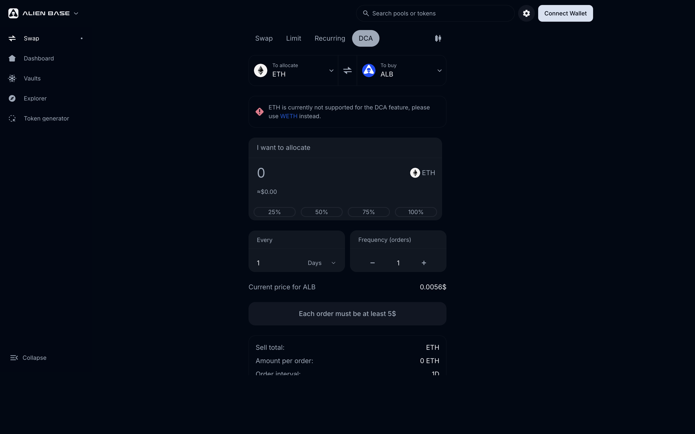

# DCA Orders

A DCA (Dollar-Cost-Average) order splits a single buy or sell into many smaller trades executed at regular intervals over time. It's the simplest way to enter or exit a large position without timing the market and without taking the price impact in one shot.

> *Last updated: {{today}}.*

## How it works

You specify:

1. The token you're selling and the token you're buying.
2. The total amount.
3. The number of trades and the interval between them (e.g., 30 trades, every 8 hours = ~10 days of execution).
4. (Optional) Price guards — minimum / maximum price to execute at, so a flash spike or dump can pause execution.

The order rests on-chain. At each interval, a small portion auto-executes — routed through Epsilon for best price.

Each individual order has a **$5 minimum**. If your `total / number_of_orders` falls below that, the UI disables the submit button.

> 
> **ETH is not supported as the source token for DCA — use WETH instead.** The dApp surfaces this as an inline warning when you pick ETH; wrap your ETH in the Swap UI first or in your wallet.
> 

## Fees

DCA orders use the same fee schedule as Epsilon — each DCA chunk is a swap, so it pays Epsilon-equivalent fees:

| Asset class | Fee per chunk |
| --- | --- |
| Blue chips (stables, ETH, BTC) | **0.03%** |
| Everything else | **0.20%** |

Plus the underlying pool fee on whichever venue Epsilon routes the chunk through. Full breakdown: [Fees](../fees.md).

## When to use a DCA

- You're entering or exiting a large position and don't want to move the market in one trade.
- You're nervous about timing — DCA averages your entry across many ticks.
- You want a "set and forget" version of accumulation without third-party software.

## When *not* to use a DCA

- You've decided this is the price you want — use a [Limit or Range Order](limit-orders.md) instead.
- You expect a binary event (catalyst, unlock) — DCA's averaging works against you here.
- You want active grid behavior — use a [Recurring Order](recurring-orders.md).

## Stop-loss DCA (post-Epsilon Router)

Once the on-chain Epsilon Router goes live (currently audited / under review), DCA orders gain a **stop-loss** option: if price falls below a configured level, the DCA aborts. This protects against catastrophic dips during long accumulation runs. See [Epsilon (meta-aggregator)](epsilon.md#on-chain-epsilon-router).

## Where it lives in the UI

[app.alienbase.xyz/trade](https://app.alienbase.xyz/trade) → **DCA** tab.

## See also

- [Limit & Range Orders](limit-orders.md) — for precise-price entry/exit.
- [Recurring Orders](recurring-orders.md) — for grid trading.
- [Fees](../fees.md)
