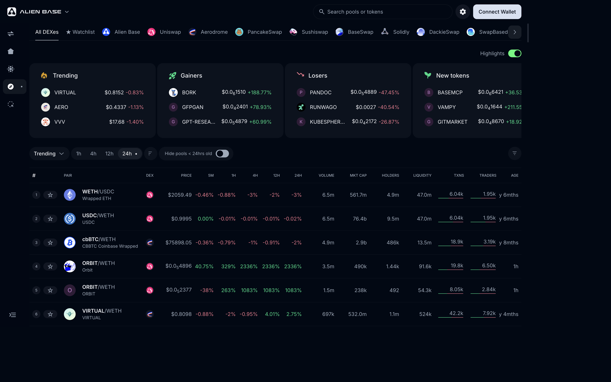

# Epsilon Analytics

**Epsilon Analytics** (the **Explorer** tab in the dApp) is Alien Base's chain-wide data explorer. Every token on Base, every pool on every DEX, every trade — searchable, with safety checks built in.

> *Last updated: {{today}}.* Launched May 2025.

## What it does

Three core surfaces:

- **Overview** — top pairs by volume, liquidity, and price action across the whole of Base. Filterable by DEX (Alien Base / Uniswap / Aerodrome / PancakeSwap / Sushiswap / BaseSwap / Solidly / DackieSwap / SwapBased), with Trending / Gainers / Losers / New tokens highlights and a configurable time window (1h / 4h / 12h / 24h).
- **Token detail** — for any token: live price, charts, holder distribution, top pools, top trades, and an automated **GoPlus safety check** flagging things like honeypot risk, owner-can-mint, blacklist functions, and so on.
- **Pool detail** — for any pool on any supported venue: TVL, 24h volume, fee tier, recent trades, and live order books for Carbon-style strategies.

Powerful filtering (Token Filters panel) lets you slice on price, liquidity, market cap, holder count, age, txn count, dev address, "show risky tokens" toggle, and more. Useful for systematic discovery; brutal for memecoin hunters.

Access via the **Explorer** tab in the Alien Base dApp.

## Why it exists

Most "DEX analytics" sites are surface-level — they list pairs, charts, maybe volumes. Alien Base's Explore is built on the same data layer that Epsilon uses for routing, which means:

- It sees **every** pool on Base, not just the most active ones.
- Token-safety signals are native; you don't need to open a separate site.
- Charts and pool stats are consistent with what the swap engine sees, so quoted prices and analytics prices match.

## Roadmap

The next-phase Epsilon Analytics work, called out on the [Roadmap](../roadmap.md):

- **TradingView integration** with on-chart order overlays + PnL tracking.
- **Wallet-cluster analysis** — multi-wallets per user, bot detection, whale activity, team-sell detection.
- **Per-strategy analytics** — for Carbon Recurring strategies, deeper PnL and capital-efficiency metrics.

## See also

- [Epsilon (meta-aggregator)](epsilon.md) — the routing engine that shares Epsilon's data layer.
- [GoPlus security API](https://gopluslabs.io/) — the third-party safety-signals provider.
