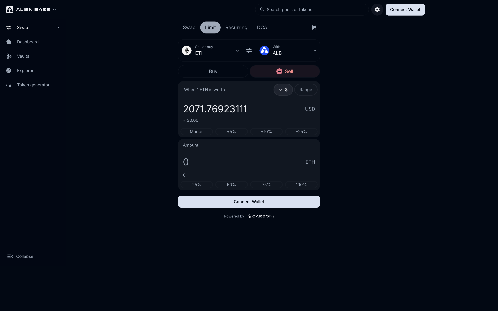
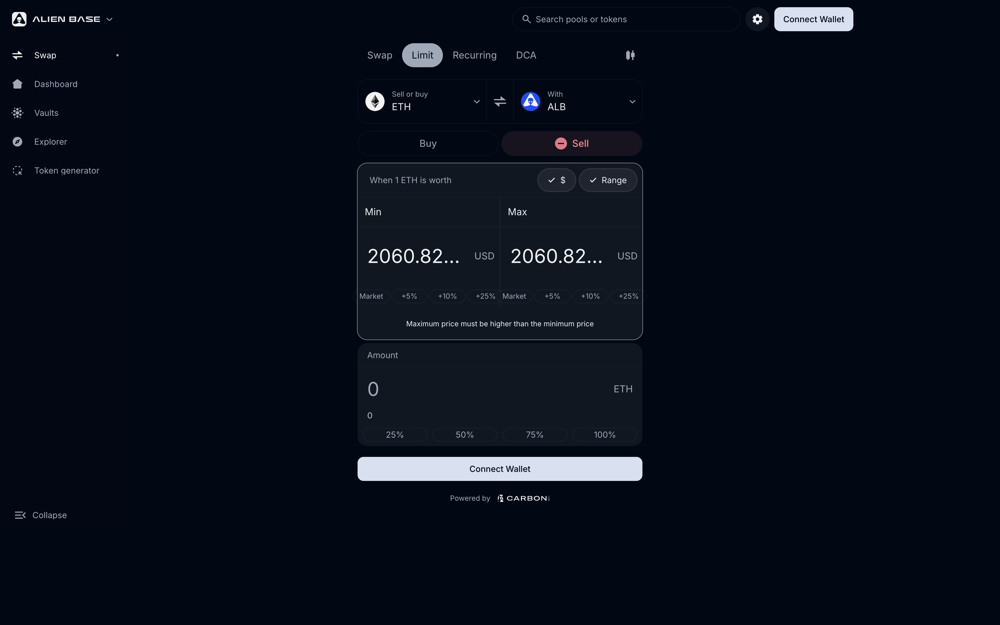

# Limit & Range Orders

Limit and Range orders let you specify the price (or price range) where you want to buy or sell, instead of taking the immediate market price. Both are powered by Alien Base's integration of Bancor's Carbon DeFi technology.

> *Last updated: {{today}}.*

## The short version

- **Limit Order** — "Buy ETH at exactly $3,000." A one-time order at a single price.
- **Range Order** — "Buy ETH between $2,800 and $3,000." A one-time order distributed across a price range.

In the dApp, both live under the **Limit** tab. There's a **Range** toggle inside that tab to switch between single-price (Limit) and price-range (Range) modes.

Both are:

- **Irreversible.** Once filled, the order doesn't reverse if price retraces. (Unlike concentrated-liquidity LP positions, which oscillate as price moves.)
- **Adjustable.** Move the price or change the size on-chain without withdrawing.
- **MEV-resistant.** The order's irreversibility prevents sandwich attacks at fill time.
- **Fully on-chain.** No off-chain order book, no centralized matching engine.
- **Non-custodial.** Your tokens stay in the order's vault until filled or withdrawn.

## Limit Order

Use a Limit Order when you want a precise entry or exit price.

**How it works.** You deposit the token you want to sell (e.g., USDC) into the order, specify the target price (e.g., 3,000 USDC per ETH), and submit. The order rests on-chain. When the market reaches your price, takers (DEX aggregators, arbitrageurs, other Alien Base users) match against your order. After fill, the bought token sits in your account for withdrawal.

**Zero slippage.** The price you set is the price you receive — no more, no less.

**Use cases.**
- "Buy ETH at $2,000 if it dips."
- "Take profit on a memecoin at +50%."
- "Set a long-term sell wall."

## Range Order

Use a Range Order when you want to fill across a price range rather than at one point.

**How it works.** You specify a low price and a high price. As the market moves through the range, your order fills incrementally — analogous to a TWAP entry.

**Use cases.**
- "Average into ETH between $2,800 and $3,000."
- "Average out of a position between $4,500 and $5,000."
- "Make liquidity available for a memecoin entry across a wide price band."

## How does this differ from V3 LP positions?

Concentrated-liquidity LP positions in V3 are **bidirectional**: as price oscillates around your range, the position swings between holding more of one asset and more of the other. That's good for fee generation but bad if you wanted a one-shot entry.

Carbon-style limit and range orders are **unidirectional**. Once filled, they don't reverse. No constant attention required.

## Fees

- **Maker spread.** You define a buy price and a sell price; the gap is your spread, and you keep all of it.
- **Alien Base fee.** **0.40% on the executed trade**, on top of your spread. Routed to the Treasury / esALB Real Yield stream.
- **Gas.** You pay gas at order creation, edit, and withdrawal. The taker pays gas at fill.

A maker's all-in revenue per fill is therefore: their spread minus the 0.40% Alien Base fee on the executed trade. Full breakdown: [Fees](../fees.md).

## Where it lives in the UI

[app.alienbase.xyz/trade](https://app.alienbase.xyz/trade) → switch from **Swap** to **Limit Order** or **Range Order**.

## See also

- [Recurring Orders](recurring-orders.md) — paired buy + sell that auto-rotate.
- [DCA Orders](dca-orders.md) — time-based splitting.
- [Creating a Strategy (tutorial)](creating-a-strategy.md)
- [Trading FAQ](faq/README.md)
