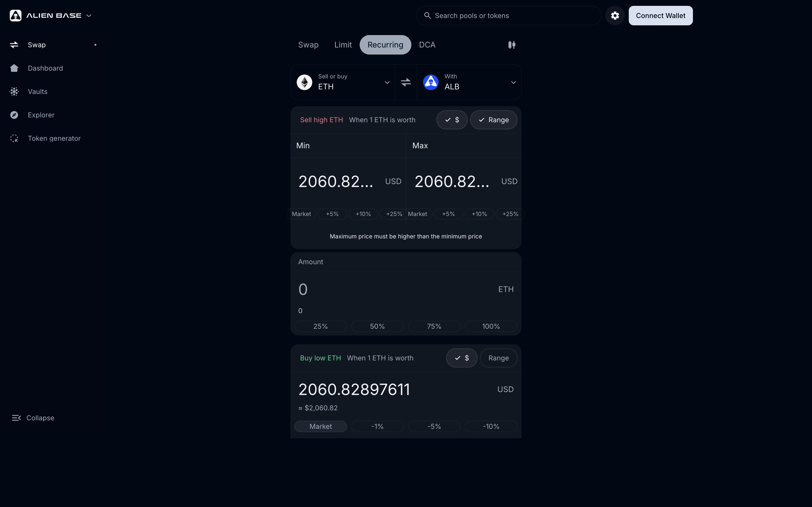

# Recurring Orders

A Recurring Order is a paired buy + sell strategy that rotates automatically. Think of it as a built-in grid-trading bot, but on-chain, MEV-resistant, and without third-party software.

> *Last updated: {{today}}.*



## How it works

A Recurring Order is two linked sub-orders:

- A **buy sub-order** that wants to acquire token A using token B at a low price (or low-price range).
- A **sell sub-order** that wants to dispose of token A back into token B at a higher price (or higher-price range).

Each side can be configured as a **Limit** order (single price) or a **Range** order (price band). When the market touches one side, that side fills, and the proceeds automatically rotate into the other side. The strategy keeps running until you withdraw it.

```
    Sell range: 3,200 → 3,400 USDC/ETH
                   ▲
                   │  proceeds rotate to buy side
   Market price ──┼──
                   │  proceeds rotate to sell side
                   ▼
    Buy range:  2,800 → 3,000 USDC/ETH
```

## The maker–taker dynamic

You're a **maker** — you provide standing liquidity at the prices you defined. Other users, aggregators, and arbitrageurs are **takers** — they fill against your liquidity at your terms.

Because the prices you set effectively define a **spread** (the gap between the buy and sell range), every full rotation captures that spread as profit. Wider spreads mean fewer fills but larger margin per fill; narrower spreads mean more fills with smaller margin. Tight spreads can earn very little if the market moves with little oscillation; wide spreads can leave you sitting in a single side for long periods.

## Why this is better than a centralized grid bot

- **Non-custodial.** Funds never leave the order's on-chain vault.
- **No subscription.** No external software, no API keys — just a flat **0.40% Alien Base fee** on each filled rotation, on top of the spread you set yourself.
- **Adjustable on-chain.** Move ranges or change sizes without withdrawing.
- **MEV-resistant.** Same irreversibility property as Limit/Range orders prevents sandwich attacks.
- **Composable.** Aggregators (Epsilon, Uniswap, others) can route through your order, increasing fill rate without you doing anything.

## Fees

Recurring orders use the same fee as Limit / Range orders:

- **Maker spread.** You define a buy range and a sell range. The gap is your spread per rotation, and you keep all of it.
- **Alien Base fee.** **0.40% on the executed trade** at every fill, routed to the Treasury / esALB Real Yield stream.
- **Gas.** You pay gas at order creation, edit, and withdrawal. Takers pay gas at fill.

Full breakdown: [Fees](../fees.md).

## Common configurations

| Goal | Setup |
| --- | --- |
| Stable / sideways market | Tight, symmetric ranges (e.g., -2% / +2% from mid) |
| Trending market | Asymmetric — wider on the side you don't expect price to go |
| Very wide range, slow accumulation | Wide ranges with large size; fewer rotations, bigger per-fill |
| Tax-efficient market making | Set the buy range overlapping the mid-price → effectively zero spread, but earns from any price movement |

## Where it lives in the UI

[app.alienbase.xyz/trade](https://app.alienbase.xyz/trade) → **Recurring** tab. Configure both sub-orders independently, then submit as a single transaction.

For a complete walkthrough of building a strategy from scratch, see [Creating a Strategy](creating-a-strategy.md).

## See also

- [Limit & Range Orders](limit-orders.md) — the underlying primitive.
- [DCA Orders](dca-orders.md) — for time-based, one-direction splitting (no rotation).
- [Trading FAQ](faq/README.md) — strategy ROI, order dynamics, common questions.
