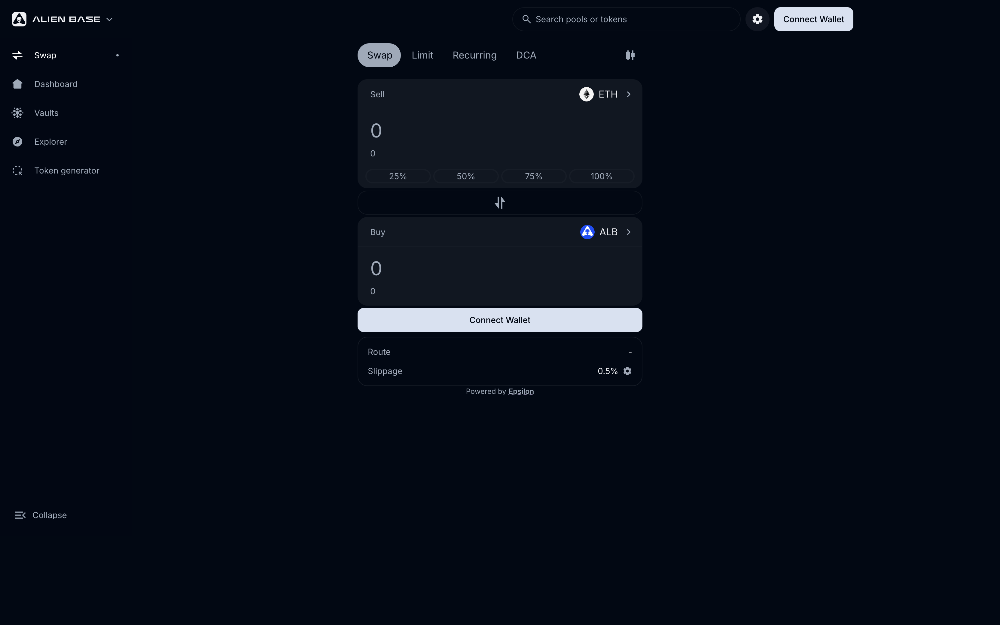

# Swap

Swap is the simplest way to trade on Alien Base. Pick two tokens, pick an amount, click Swap. Behind the scenes [Epsilon](epsilon.md) routes the trade across every venue on Base to give you the best price.

> *Last updated: {{today}}.*

## How a swap works

1. Open [app.alienbase.xyz/swap](https://app.alienbase.xyz/swap).
2. Connect your wallet.
3. Choose the token you're selling (top) and the token you're buying (bottom). Tokens can be selected from the curated list or pasted as a contract address — Alien Base supports any ERC-20 on Base.
4. Enter an amount. The UI shows the quoted output, route, price impact, and fee breakdown.
5. (Optional) Adjust slippage tolerance under Settings (default 0.5%).
6. Click **Swap** → review the modal → confirm in your wallet.

## What the route shows

For every quote, Alien Base displays the route Epsilon found:

- **Direct pool** — the trade is a single hop in a single Alien Base pool (V2 or V3).
- **Multi-hop** — the trade goes through 2+ pools (e.g., TOKEN → WETH → USDC).
- **Multi-venue** — the trade splits across pools on Alien Base, Aerodrome, Uniswap, etc., to minimize price impact.

The route directly affects the fee you pay; see [Fees](../fees.md) for the full breakdown.

## Slippage

Slippage is the maximum acceptable difference between the quoted price and the executed price. If the price moves more than your tolerance during transaction submission, the swap reverts.

Sensible defaults:

- **0.1–0.5%** for stablecoin / blue-chip pairs.
- **0.5–1%** for typical token swaps.
- **2–5%+** for low-liquidity tokens or memecoins with on-trade fees.

If slippage is set too low for a volatile token, the swap will revert (and you'll burn gas). If set too high, your trade can be sandwich-attacked. Aim for the lowest value that lets the trade complete reliably.

## On-trade fees in tokens

Some Base tokens take an on-trade fee (a "tax" or "burn") inside their transfer logic. If you're trading one of these, set slippage high enough to cover the on-trade fee. The Alien Base UI surfaces a warning when it detects a known fee-on-transfer token.

## What happens after Swap

- Transactions usually confirm in 1–3 seconds on Base.
- A success notification shows the new balances and links to the Basescan transaction.
- Swaps are also visible in the wallet's history view and on Alien Base's analytics.

## Common issues

- **"Insufficient funds for gas."** Base needs a small amount of ETH for gas. Bridge or buy ~$1 worth.
- **"Price impact too high."** Liquidity is shallow for this pair. Try a smaller size or split the order.
- **"This swap is being protected by MEV."** Alien Base routes some trades through MEV-resistant lanes; nothing to action.
- **Pending transaction won't confirm.** See [Pending or failed transactions](../common-issues/pending-or-failed-transactions.md).

## See also

- [Epsilon (meta-aggregator)](epsilon.md)
- [Limit & Range Orders](limit-orders.md) — for "buy at price X" instead of immediate market orders.
- [DCA Orders](dca-orders.md) — for splitting a buy/sell over time.
- [Fees](../fees.md)
