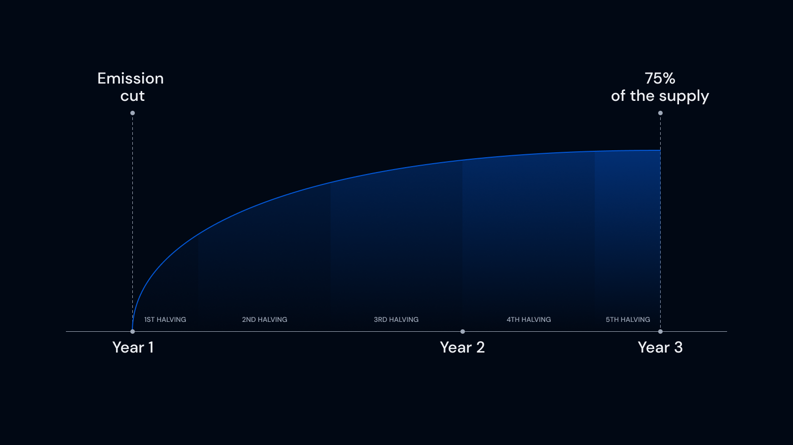

# ALB Token

The Alienbase Token ($ALB) is the governance token of the platform designed to bootstrap a DAO around the Alienbase ecosystem.

It has a Max Supply of 510,000,000 tokens to be distributed mostly through farming with LP tokens on the Alienbase DEX.

Emission is expected to last for 3 years after TGE on August 8, 2023, after which the platform should become self-sustainable.&#x20;

<figure><figcaption></figcaption></figure>

**Emission Schedule**

The initial design assumed an initial heavy distribution period that would see 22.5% of the supply minted in the first three months. The speed of emission would be halved after the first three months, and continue to do so every 9 months until August 2026. Thus, the rewardsPerSecond parameter of ALB emission would scale as follows:

| ALB Per Second | Trigger Month |
| -------------- | ------------- |
| 15             | August 2023   |
| 7.5            | November 2023 |
| 3.75           | August 2024   |
| 1.875          | May 2025      |
| 0.9375         | February 2026 |

The plan assumed an initial circulating supply of 25 million ALB, which due to early sniper and community interest became impossible to add to the fair launch liquidity pool.

After three weeks of the initial distribution schedule, the community and team have agreed to reduce emission by 46% to 4% total supply every month, or 8 ALB per second: [https://snapshot.org/#/alienbase-dex.eth/proposal/0x56c418fd7f7fd365b0beba44389807941e3150fb376179ac758fb497f04a999b](https://snapshot.org/#/alienbase-dex.eth/proposal/0x56c418fd7f7fd365b0beba44389807941e3150fb376179ac758fb497f04a999b)

The future schedule remains unchanged for now, with a planned reduction to 7.5 ALB per second in November.

The total minted after 36 months will be approximately 75.3% of the total supply. Thus after three years the total supply will be as follows:

|              |           |   |
| ------------ | --------- | - |
| Initial Mint | 5.1%      |   |
| Farming      | 75.3%     |   |
| **Total**    | **80.4%** |   |

The remaining 19.6% of the supply can be theoretically minted through a DAO decision should the need arise. The supply schedule can be changed pending DAO decision, including steeper reductions of the farming rewards if the protocol reaches sustainability before the expected time frame.

The team currently **cannot mint tokens** without going through a total 14 day time lock (farming emissions parameters are likewise timelocked for 7 days).

**Initial Supply Timelock & Token Distribution**

The initial 25 million tokens (\~5% of the total supply) that could not be placed in liquidity were directed to a timelock contract as a temporary measure.

The timelock transactions are listed below:

* &#x20;[https://basescan.org/tx/0x44d3753e8e0e104f4751665af885c77fc8ee338abd377496cb33b1a35b10aca9](https://basescan.org/tx/0x44d3753e8e0e104f4751665af885c77fc8ee338abd377496cb33b1a35b10aca9)
* [https://basescan.org/tx/0x5936515cc428ce9d66396d995b490f059da4152c182e1e8f42dc7ce6a38fd278](https://basescan.org/tx/0x5936515cc428ce9d66396d995b490f059da4152c182e1e8f42dc7ce6a38fd278)
* [https://basescan.org/tx/0x079a3f09c533fd61768cfb88d2fdf21effd67c4311819974ddc446b342b5540d](https://basescan.org/tx/0x079a3f09c533fd61768cfb88d2fdf21effd67c4311819974ddc446b342b5540d)

Of these, **20 million** **ALB** are to be devoted to growing the project over time: fundraising from investors, marketing expenses as well as market making to grow liquidity of ALB and the DEX as a whole.

The remaining **5 million** are to be distributed to the team with vesting contracts (currently yet to be deployed and distributed).

Of the current farming emissions, 15% of the tokens minted are reserved to the team as an operating budget and reserve. Another 15% is reserved to the DAO and marketing initiatives that bring the protocol forward.

To support operations, the team has announced that up to 600,000 ALB per month can be devoted to cover salaries for development and incentivization. More can be found here: [https://medium.com/@alienbase/strategic-roadmap-update-for-alien-base-c569f2bfcc46](https://medium.com/@alienbase/strategic-roadmap-update-for-alien-base-c569f2bfcc46)

**Value Distribution for ALB**

The Alien Base platform was designed with fees in mind: the DAO can claim 50% of all trading fees on the base layer, and we expect similar distribution with future AMM and revenue-generating products (StableSwap, Concentrated Liquidity, Options and more).

The vision for ALB is to provide incentives via fee redistribution in "real yield" delivered directly in ETH or other extremely liquid assets.

This will be achieved through **esALB** tokenomics (escrowed ALB). In this model, holders will be able to lock their tokens to receive platform fees and extra anti-dilution rewards delivered in esALB. Platform incentives will be delivered in combined ALB + esALB rewards to disincentivize fully mercenary behavior.

While the full transition to this model is expected to happen throughout Q4 2023, in the meantime stakers of ALB receive fees from the Area 51 platform, Alien Base's launchpad and Sub-DEX. As the protocol matures and is able to sustain increased liquidity for the token, more and more sources of revenue will be directed to tokenholders.

