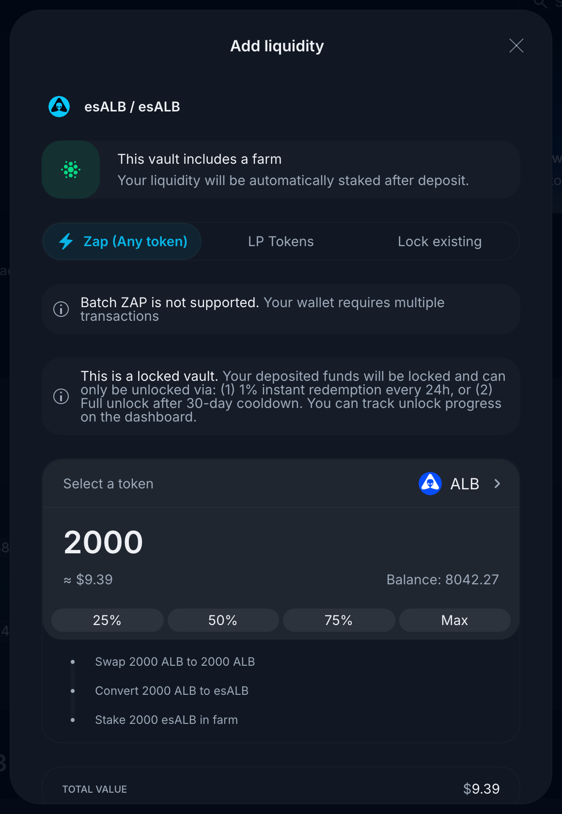
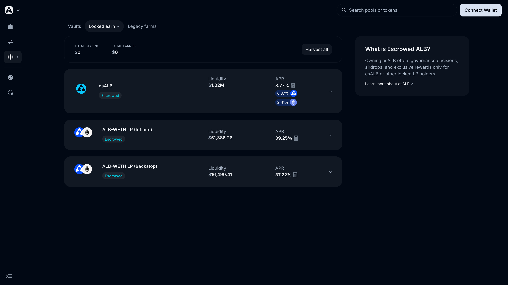
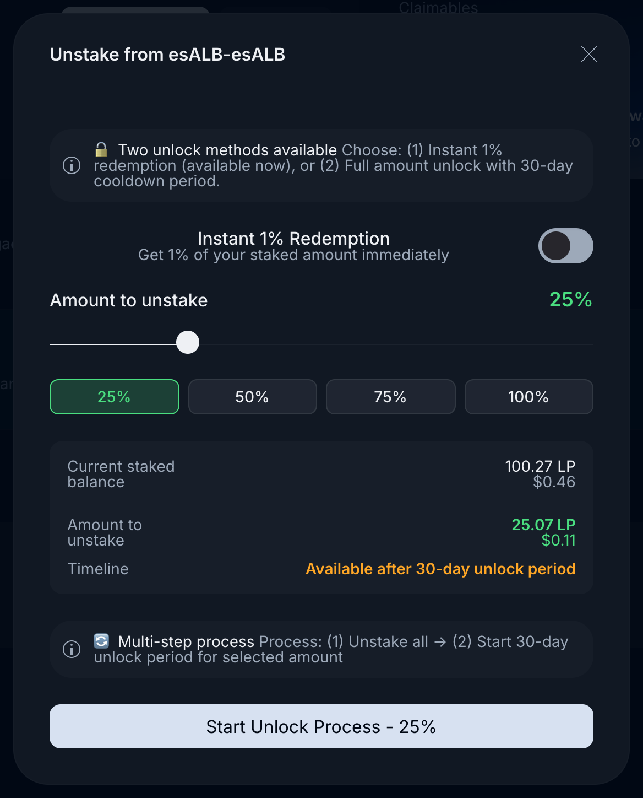

# Escrowed ALB (esALB)

**esALB** is the locked, non-transferable form of ALB. It's the asset that earns governance voting power, single-staking APR, and **Real Yield** (WETH from protocol fees). If you plan to hold ALB long-term, you almost certainly want it as esALB.

> *Last updated: July 6, 2026.*

## In one paragraph

You convert ALB → esALB **1:1** via **Lock & Earn** on the [Dashboard](https://app.alienbase.xyz/dashboard). esALB is non-transferable. You can stake esALB to earn unlocked ALB, vote on Snapshot, and receive Real Yield in WETH. To convert back, you use one of two paths (mixable): **100% after a 30-day cooldown** with no penalty, or **1% instantly every 24 hours**. Both are documented below.

## At a glance

| | |
| --- | --- |
| esALB token | [`0x365c6d58…4113`](https://basescan.org/address/0x365c6d588e8611125de3bea5b9280c304fa54113) |
| Lock ratio | 1 ALB → 1 esALB (and back) |
| Transferable? | No. esALB is bound to the address that minted it. |
| Voting weight | 1× per esALB (10× per [govALB](#govalb-coming-via-aip-5) once AIP-5 ships) |
| Earn while staking? | Yes — unlocked ALB rewards from the esALB single-stake vault |
| Real Yield? | Yes — pro-rata share of WETH protocol fees |

## What esALB is for

- **Single-staking APR.** Stake esALB under **Locked earn** on the [Vaults](https://app.alienbase.xyz/vaults) page to farm unlocked ALB.
- **Real Yield.** Stakers earn a share of protocol fees, paid in **WETH**, **USDC**, and other liquid assets — not in extra ALB inflation. Details: [Real Yield](real-yield.md).
- **Governance.** Voting power on Snapshot is weighted by esALB. See [Alien Base DAO](../alien-base-dao/README.md).
- **Airdrops & extra rewards.** Targeted distributions (partner tokens, special-event drops) generally land in esALB holders' wallets.

## How to lock ALB into esALB

1. Open the [Dashboard](https://app.alienbase.xyz/dashboard) and click **Lock & Earn** (also available from the **Locked earn** tab on the Vaults page via **Lock & Stake**).
2. Pick the **Escrowed ALB (esALB)** farm. A deposit modal opens.
3. Choose your input: **Zap (any token)**, **LP Tokens**, or **Lock existing** ALB.
4. Enter the amount. The modal previews each step (e.g., swap → convert to esALB → stake in farm).
5. Approve and confirm the transactions (batch zap isn't supported, so expect one transaction per step).

Your deposit is automatically staked in the esALB farm after conversion. You'll receive 1 esALB for every ALB locked. To see the esALB balance in your wallet, add the contract address [`0x365c6d58…4113`](https://basescan.org/address/0x365c6d588e8611125de3bea5b9280c304fa54113) as a custom token.

## Staking esALB

After locking, head to the [Vaults](https://app.alienbase.xyz/vaults) page → **Locked earn** tab. The **esALB** position is at the top, next to the escrowed ALB-WETH LP positions (Infinite and Backstop).

1. Click **Enable** to authorize the staking contract to move esALB.
2. Click **Stake** and choose the amount.
3. Rewards (unlocked ALB) accrue continuously. The APR is shown split by source (ALB emissions vs. Real Yield). Click **Harvest** (or **Harvest all**) any time to claim.

Your staked esALB still counts for **governance voting** and **Real Yield**.

## How to unlock back to ALB

Open the **Locked earn** tab on the Dashboard, find your **Escrowed ALB (esALB)** farming position, and click the unstake icon. The unstake modal offers two redemption paths (mixable):

### Path A — full unlock after a 30-day cooldown, no penalty

1. In the unstake modal, choose the **amount to unstake** (slider or 25/50/75/100% presets), leaving **Instant 1% Redemption** off.
2. Click **Start Unlock Process**. This is a multi-step transaction: unstake, then start the 30-day unlock period for the selected amount.
3. The position moves to **Locked → Vested** on the Dashboard, where you can track unlock progress. While vesting, **you continue to earn rewards at a 30% reduction**.
4. After 30 days, redeem the full amount as ALB.

> 
> You have **7 days** to redeem after vesting completes. If you miss the window, the position re-locks and starts a new 30-day vesting cycle.
> 

### Path B — 1% instant redemption, every 24 hours

1. In the unstake modal, toggle **Instant 1% Redemption** on.
2. Confirm the transaction. You instantly receive 1% of your staked esALB back as ALB.
3. You can repeat every 24 hours.

The 1% is computed against your **total** esALB position, including any portion currently in 30-day vesting. You can use both paths simultaneously — e.g., put half into 30-day redemption and drip the rest 1% per day.

## Common pitfalls

- **"I don't see my locked esALB on the Dashboard."** It's probably staked in the esALB Single Stake vault. Unstake first; it'll reappear under your portfolio.
- **"My approve transaction succeeded but Lock still says I need to approve."** Likely an allowance-cap quirk on Base. See [Changing allowance](changing-allowance.md).
- **"I missed the 7-day redeem window."** It auto-relocks. Re-trigger redemption to start a fresh 30-day cycle, or use Path B to drip out.
- **"Why is my staking APR lower than expected?"** APR includes the unlocked ALB stream from the vault. The Real Yield (WETH) is shown separately. Total economics is APR + WETH yield + governance optionality.

## govALB (coming via AIP-5)

[AIP-5](https://medium.com/@alienbase/aip-5-building-alien-base-2-0-96dc24984cd2) introduces **govALB** — a longer-locked variant of esALB that confers **10× voting weight**. The trade-off is a longer effective lock (~2 years). It's designed for users who want maximum governance influence and are willing to commit time for it. Mechanics will be documented as it rolls out — see [Alien Base 2.0](../alien-base-2-0.md).

## Live data

The [Dune dashboard](https://dune.com/sealaunch/alienbase) tracks esALB live:

- **esALB Holders** — current count and growth over time.
- **ALB locked on esALB** and **ALB in esALB** — the supply view.
- **ALB-esALB Lock/Unlock** — daily inflows/outflows between ALB and esALB.
- **Total Holders (ALB + esALB)** — combined holder count, useful for evaluating decentralization.

## See also

- [esLP](eslp.md) — locked LP positions (e.g., ALB-ETH).
- [Vesting](vesting.md) — long-form vesting schedules (team, advisors, contributors).
- [Real Yield (WETH)](real-yield.md) — the protocol-fee distribution mechanism.
- [Changing allowance](changing-allowance.md) — fixing the "approve but won't lock" issue.
- [Data & Analytics](../data-and-analytics.md) — full data-source map.
- [Introducing EsALB: The Next Phase of Alien Base Tokenomics](https://medium.com/@alienbase/introducing-esalb-the-next-phase-of-alien-base-tokenomics-e5bfa049486f) — original launch article.
