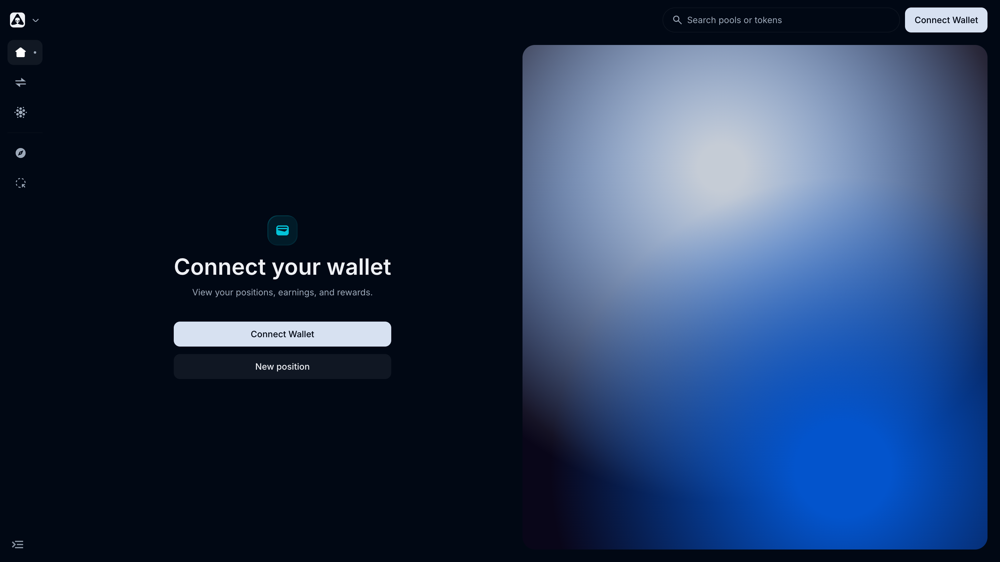
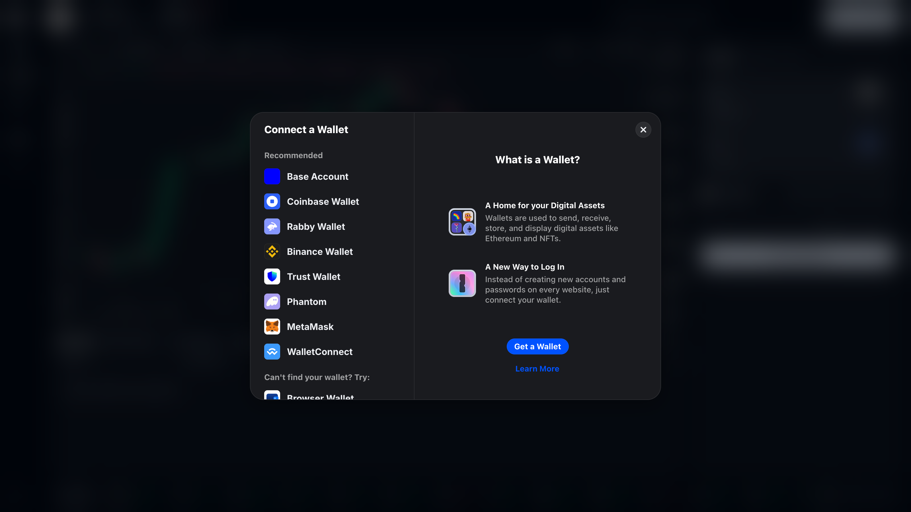
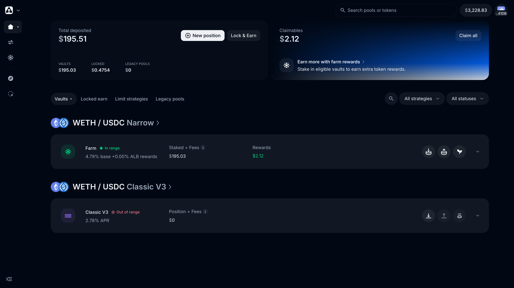

# Connecting your wallet

Alien Base works with any standard EVM wallet. There's nothing custom on the wallet side — the app supports the standard `wallet_connect` and WalletConnect flows.

> *Last updated: July 6, 2026.*

## Supported wallets

- **Coinbase Wallet** — extension, mobile, in-app browser. Widely used on Base; native fit.
- **MetaMask** — extension and mobile.
- **Rabby Wallet** — extension. Strong UX for advanced users; auto-detects networks.
- **WalletConnect-compatible wallets** — Trust Wallet, Phantom (with EVM support), Ledger, Keystone, etc.
- **Frame** — desktop signer; useful for hardware-wallet workflows.

## How to connect

1. Visit [app.alienbase.xyz](https://app.alienbase.xyz/).
2. Click **Connect Wallet** (top right).
3. Pick your wallet from the list.
4. Approve the connection in your wallet.
5. Verify the **Base** network is selected. The app will prompt you to switch if needed.

Once connected, the Dashboard shows your full portfolio on Base — asset allocation, vault deposits, locked positions, and claimable rewards:

## Adding Base manually

If your wallet doesn't auto-suggest Base, add it manually:

| Field | Value |
| --- | --- |
| Network name | Base |
| RPC URL | `https://mainnet.base.org` (or any reputable Base RPC) |
| Chain ID | `8453` |
| Currency symbol | `ETH` |
| Block explorer | `https://basescan.org` |

The official Base RPC is solid for casual use. For higher throughput or more reliability, consider a paid endpoint (Alchemy, QuickNode, Ankr). See the [RPC Troubleshooting Guide](../common-issues/rpc-troubleshooting-guide.md).

## Using a hardware wallet

Both Ledger and Keystone work with Alien Base via:

- **Coinbase Wallet** (Ledger via "Add Hardware Wallet" flow).
- **MetaMask** (Connect Hardware Wallet).
- **Rabby** (Connect Hardware Wallet).
- **Frame** (desktop signer that exposes the hardware wallet to dApps).

For the safest setup with significant balances: use a hardware wallet through Frame or Rabby, blind-sign disabled, every transaction reviewed on the device.

## Disconnecting

Click your wallet address in the top-right of the app and select **Disconnect**. The app cannot make any further requests to your wallet until you reconnect.

## Privacy / what the app sees

When you connect, Alien Base's frontend can:

- See your wallet address.
- Read your token balances and transaction history (this is on-chain anyway).
- Request signatures and transactions; your wallet always asks you to confirm.

It cannot:

- Move funds without your explicit signature.
- Drain your wallet by being "connected".

A "connected" wallet is just a session token. Approvals (token allowances) are separate — they are explicit transactions, and they're the actual mechanism by which a contract can spend your tokens. To audit and revoke them, see [Managing Token Allowance](../common-issues/managing-token-allowance-guide.md).

## Common issues

- **"Wrong network."** Switch to Base in your wallet's network selector.
- **"Wallet not detected."** Some browsers need the extension reloaded; some need you to disable competing wallet extensions.
- **"Connect button does nothing."** Pop-up blocker likely. Allow popups from `app.alienbase.xyz`.
