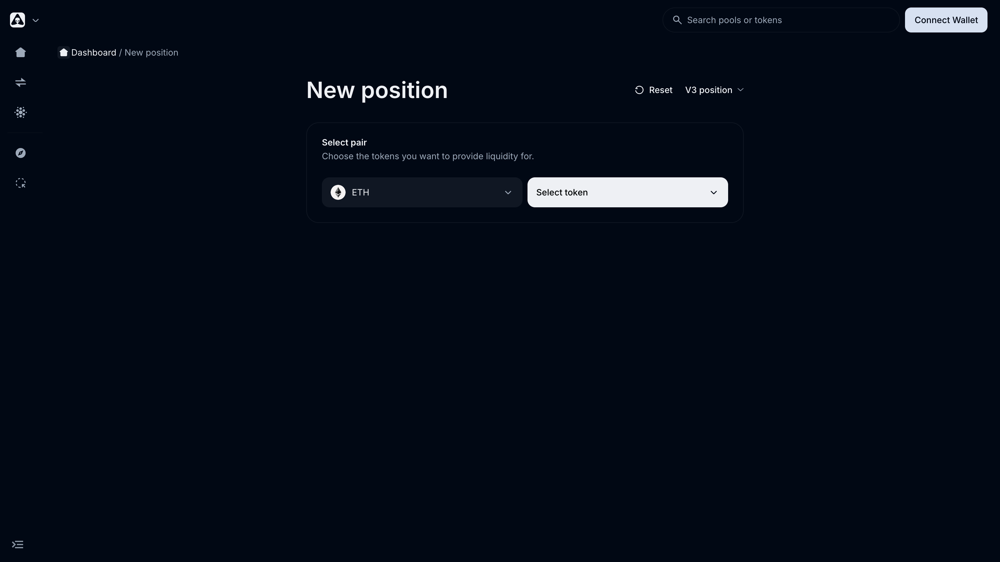

# Concentrated Liquidity (V3)

Alien Base V3 implements Uniswap V3-style **concentrated liquidity**: instead of spreading your capital across the whole price curve, you pick a price range and concentrate your liquidity there. The result is much higher capital efficiency at the cost of being out-of-range when price moves outside your bounds.

> *Last updated: July 6, 2026.*

## Fee tiers

Alien Base V3 supports **seven fee tiers**. The right choice depends on the volatility of the pair:

| Fee | Best for |
| --- | --- |
| **0.01%** | Tightly-pegged stablecoin pairs (USDC/USDbC, USDC/USDT) |
| **0.02%** | Standard stablecoin pairs |
| **0.03%** | LSDs and very-blue-chip volatile pairs (ETH/cbETH) |
| **0.04%** | Wider-spread stable / LSD pairs |
| **0.075%** | Blue chips (ETH, BTC and wrapped variants) |
| **0.30%** | Mid-cap and standard tokens |
| **1.00%** | Small-cap and memecoin pairs |

Each pool collects its tier on every swap. Pool fees are split **50% to LPs / 50% to esALB stakers** as Real Yield (paid in WETH and the underlying tokens). Full breakdown: [Fees](../fees.md).

## How concentrated liquidity works

- Each LP position has a **lower price** and an **upper price**.
- While the market price is **inside** the range, the position earns trading fees and oscillates between the two assets.
- While **outside** the range, the position holds 100% of one asset and earns no fees.

A narrower range = more fees per dollar **when in range**, more frequent re-balancing needed. A wider range = fewer fees per dollar **but** less attention required.

Choose ranges that match your view of where the asset will trade.

## Two ways to provide V3 liquidity

### Option A — Vaults (Bunni-wrapped, recommended for most users)

Use the [Vaults](vaults.md) page. Pick a pre-configured strategy (Wide / Narrow / Ultra Narrow / Classic V3), deposit, and earn pool fees + ALB rewards. The position is wrapped as an ERC-20 share by [Bunni](bunni.md), which means:

- No NFT to manage.
- Composable — can be staked, locked, or used elsewhere.
- One-click Zap-in from any asset.

Range bounds are managed at the Vault level. When a Vault gets close to its bounds, a new Vault with refreshed bounds is deployed.

### Option B — Manual V3 (full control)

Click **New position** on the [Vaults](vaults.md) or Dashboard page. Pick **V2 or V3** with the selector, choose your pair, fee tier, lower price, and upper price. The V3 position is created as a Uniswap-style NFT. You can:

- Choose any range you want.
- Add or remove liquidity at will.
- Collect fees independently.
- Re-balance manually as the market moves.

The trade-off: you get full flexibility but the position is **not** automatically eligible for ALB farm rewards (those are paid on Bunni-wrapped Vaults), and you have to actively manage the range.

## When out-of-range happens

If price exits your range:

- Your position holds 100% of whichever asset is on the "wrong" side.
- You stop earning fees.
- You're effectively long the asset (or paid in the asset) at your range boundary.

To re-engage, either:
- Wait for price to come back into range, or
- Withdraw and re-deposit into a new range.

For Bunni Vaults, the protocol manages this at the Vault level: if a Vault drifts toward its boundary, a fresh Vault is launched. You can migrate when convenient — but no automatic migration happens. (That's exactly the gap [Mothership](mothership.md) is designed to fill, with active strategies that re-balance on your behalf.)

## Source code

- V3 core: forked from Uniswap V3.
- ERC-20 wrapping: forked from Bunni / Timeless Finance.
- Repos: [`alienbase-xyz`](https://github.com/alienbase-xyz/) (see Bunni-* repos).

Audit lineage: see [Audits & Security — V3 / Bunni](../audits-and-security.md).

## See also

- [Vaults overview](vaults.md)
- [Bunni explainer](bunni.md)
- [V2 Pools (legacy)](v2-pools.md)
- [Mothership](mothership.md)
