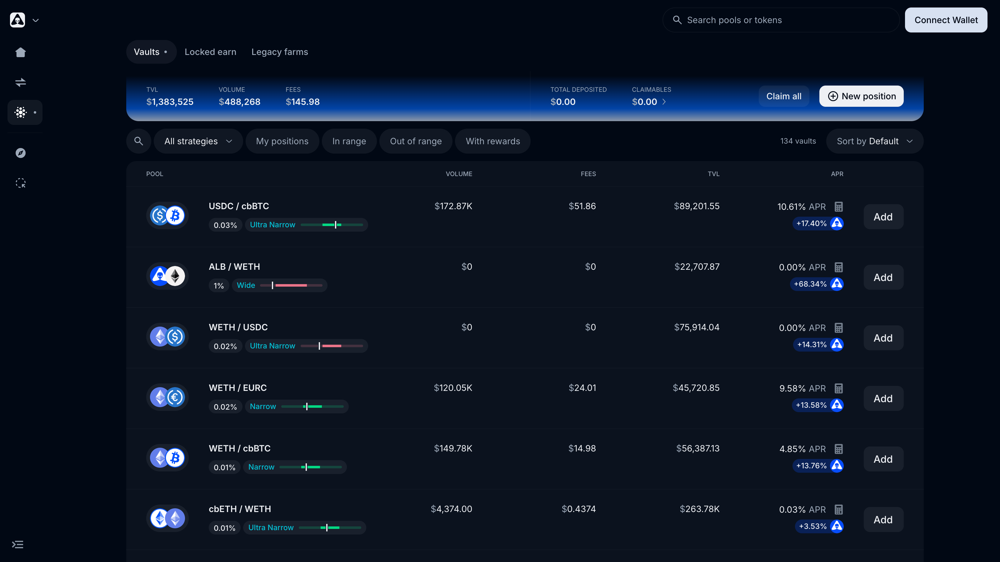
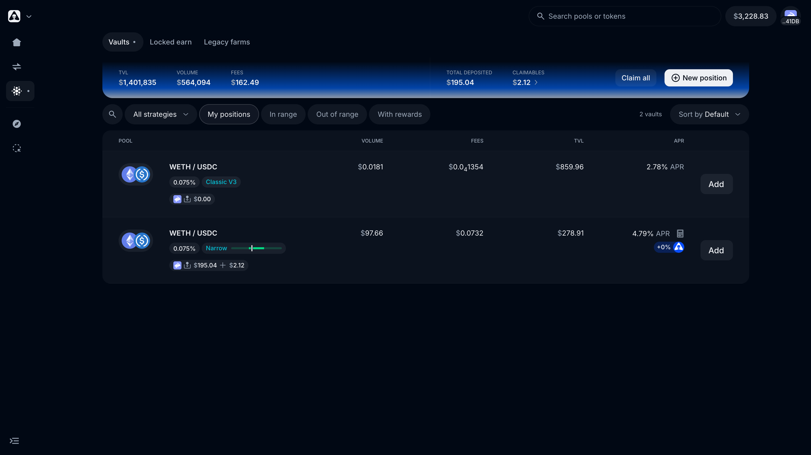

# Vaults overview

The **Vaults** page ([app.alienbase.xyz/vaults](https://app.alienbase.xyz/vaults)) is the central UI surface for every yield-bearing position you hold on Alien Base. It has three tabs:

- **Vaults** — V3 strategy vaults (Bunni-wrapped concentrated liquidity), 130+ live.
- **Locked earn** — esALB and escrowed-LP single-stake positions.
- **Legacy farms** — the old V2 MasterChef farms, kept for withdrawal.

> *Last updated: July 6, 2026.* Vaults launched January 2026 (replacing the legacy Farms tab) and were redesigned with the July 2026 app upgrade.

## Vaults tab

Each vault is a static-range V3 LP position wrapped as an ERC-20 by [Bunni](bunni.md), tagged with a named **strategy** that tells you how tight its range is:

| Strategy | Range style | Trade-off |
| --- | --- | --- |
| **Wide** | Broad range, sized on up to ~2 years of price history | Lower APR, rarely goes out of range |
| **Narrow** | Tighter range | Higher fee capture, needs occasional migration |
| **Ultra Narrow** | Very tight range (stables, correlated pairs) | Highest capital efficiency; out-of-range risk on volatile pairs |
| **Classic V3** | Standard concentrated range | The original V3 vault style |

The page header shows platform-wide **TVL / Volume / Fees**, plus your **Total deposited** and **Claimables** with a **Claim all** button. Each row shows the pool, fee tier, strategy tag, volume, fees, TVL, and APR — including the boosted ALB-rewards APR where active.

Filters: **All strategies / My positions / In range / Out of range / With rewards**, plus strategy-type tabs (All / Wide / Narrow / Ultra Narrow / Classic V3).

### Depositing

1. Connect wallet.
2. Find a vault (filter or search) → click **Add**.
3. Choose the asset and amount — the Zap flow takes a single asset (e.g., ETH or USDC), splits it appropriately, and creates the LP position in one transaction.
4. Approve (one-time per token) → confirm.
5. The position appears under **My positions**; rewards accrue immediately.

### Range lifecycle

When a vault's range gets close to its bounds, a new vault is deployed with refreshed bounds. Old vaults remain available so existing depositors can decide whether to migrate — the **Out of range** filter surfaces positions that need attention.

## Locked earn tab

Single-stake escrowed positions (see [esALB](../escrowed-alb-esalb/README.md) for the full mechanics):

| Position | What it is |
| --- | --- |
| **esALB** | Locked ALB. Earns unlocked ALB emissions + Real Yield (WETH); APR is shown split by source. |
| **ALB-WETH LP (Infinite)** | Escrowed LP: lock ALB-WETH LP tokens for boosted rewards. |
| **ALB-WETH LP (Backstop)** | Escrowed LP variant that acts as protocol backstop liquidity. |

The tab header tracks your **Total staking** and **Total earned**, with a **Harvest all** button.

## Legacy farms tab

The pre-2026 V2 MasterChef farms (ALB-ETH, ETH-USDbC, and others). Emissions to these farms have wound down under [AIP-5](../alien-base-2-0.md) — multipliers sit at 0x — so this tab exists mainly for **unstaking legacy positions**. New liquidity should go to the Vaults tab.

## New position (raw V2 / V3)

For LPs who want full control — pick your own pair, fee tier, and range — the **New position** button opens the manual flow with a **V2 / V3** selector. See [Concentrated Liquidity (V3)](v3.md) and [V2 Pools](v2-pools.md).

## Mothership

Actively-managed multi-range vaults arrive with [Mothership](mothership.md), Alien Base's in-house ALM (audit in flight). Mothership-managed vaults will appear on this same page.

<!-- TODO:USER (hidden): confirm whether Mothership will charge a manager fee + performance fee at launch. -->

## See also

- [Concentrated Liquidity (V3)](v3.md)
- [Bunni explainer](bunni.md)
- [V2 Pools (legacy)](v2-pools.md)
- [Mothership](mothership.md)
- [esALB](../escrowed-alb-esalb/README.md)
