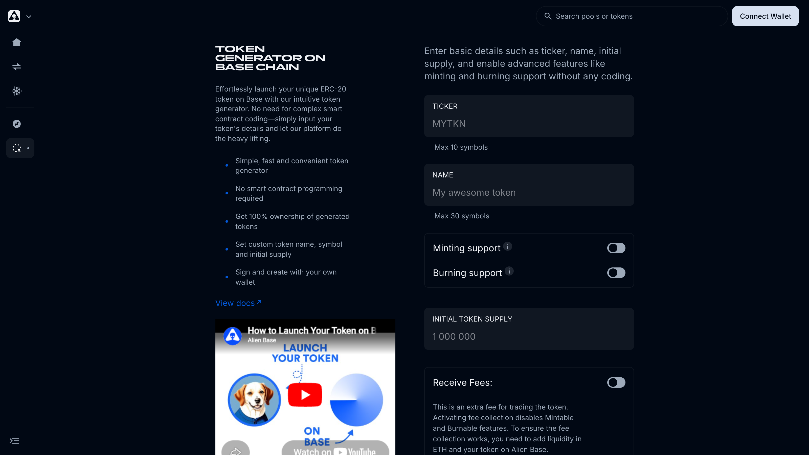

# Token Generator

The **Token Generator** lets you deploy an ERC-20 on Base from a small set of battle-tested templates, without writing or compiling any Solidity. Tokens deploy verified on Basescan and are immediately tradeable on Alien Base or any other Base DEX.

> *Last updated: July 6, 2026.*

## Cost

A flat **0.015 ETH per token mint**, regardless of template. The fee is non-refundable and feeds the protocol operating budget.

## What you can configure

The dApp consolidates the underlying templates behind three toggles:

- **Minting support** — turns the contract into a Mintable (or Mint/Burn) variant. Owner can mint additional tokens after deployment.
- **Burning support** — turns the contract into a Burnable (or Mint/Burn) variant. Holders can call `burn(...)` to reduce supply.
- **Receive Fees** — turns the contract into a Tax token. Buy/sell taxes are charged on trades and routed to a configurable wallet and/or auto-added to LP. Activating this **disables** Minting and Burning, and the Tax token requires liquidity on Alien Base for fee collection to work.

| Configuration | Underlying template | Best for |
| --- | --- | --- |
| Both toggles off | Simple Token | Memecoins, basic ERC-20 use cases. OpenZeppelin-based, no privileged owner. The safest pick for trader trust. |
| Mint on | Mintable Token | Farm tokens, DeFi rewards tokens, project ecosystems. Often considered a red flag by traders unless ownership is renounced. |
| Burn on | Burnable Token | Deflationary tokenomics. Anyone can burn their own tokens; reduces circulating supply. |
| Mint + Burn | Mint/Burn Token | Niche farming tokenomics. |
| Receive Fees | Tax Token | Memecoin tokenomics with built-in fees. Lineage traces to Toshi, Mochi, TYBG, and the original SafeMoon / Shiba pattern. |

## Factory contracts

All token deployments are routed through one of these factories. The factories themselves are non-upgradeable — once deployed, the templates they produce are immutable.

| Type | Address |
| --- | --- |
| Simple Token | [`0x3b014572…D176`](https://basescan.org/address/0x3b01457255bD6ec460D9Ab8f31CFabd8a710D176) |
| Mintable Token | [`0x6a9668c2…8369`](https://basescan.org/address/0x6a9668c2C6E1FB107021375BaCD9d92e79cc8369) |
| Burnable Token | [`0xF5A7A624…2c79`](https://basescan.org/address/0xF5A7A624f4c11F581eb5a2B12e9bcA327F692c79) |
| Mint/Burn Token | [`0x872521B4…AF51`](https://basescan.org/address/0x872521B46095139e70A38AE3e8d95611649AAF51) |
| Tax Token | [`0x13De15f0…6373`](https://basescan.org/address/0x13De15f0c5E8CC78Ad3a7001bA2Cb882aaE96373) |
| Orchestrator (entry contract) | [`0xBcE75497…d08d`](https://basescan.org/address/0xBcE75497D72b25c3509B62ae1a47CCfb502AD08d) |

The orchestrator is currently owned by the team deployer EOA. Migrating it to the DAO Multisig is a roadmap item — see the [onchain control surface](../../audits-and-security.md#onchain-control-surface).

## How to deploy

1. Open [app.alienbase.xyz/tokenGenerator](https://app.alienbase.xyz/tokenGenerator).
2. Connect wallet (must be on Base, with at least 0.015 ETH for the deployment fee plus a small amount for gas).
3. Fill in:
   - **Ticker** (max 10 characters, e.g., "AWESOME")
   - **Name** (max 30 characters, e.g., "Awesome Token")
   - Toggle **Minting support** and/or **Burning support** as needed.
   - **Initial Token Supply** (e.g., 1,000,000)
   - (Optional) Toggle **Receive Fees** to deploy a Tax token; fill in fee percentage and recipient wallet.
4. Click **Deploy Token**. The token deploys and verifies automatically on Basescan.

Within a couple of minutes the token will appear on DexScreener, GeckoTerminal, etc., once you've added liquidity (see below).

## After deployment

The token is live but illiquid. Typical next steps:

1. **Create a liquidity pool.** **New position** on [app.alienbase.xyz/vaults](https://app.alienbase.xyz/vaults) → V2 (full-range, simplest) or V3 (concentrated).
2. **Lock or burn LP** to signal trust to early traders. (You can use Gempad, Team Finance, or burn to `0x…dEaD` for a hard burn.)
3. **Add token info on Basescan.** Logo, website, socials. Many other sites (DexScreener, MetaMask, GeckoTerminal) pick this up automatically.
4. **Renounce ownership** if applicable. For Mintable and Tax templates this is a strong trust signal once you're done configuring.

The [FAQ](faq.md) covers all of these in more detail.

## Roadmap — Token Generator v2

Per the [Roadmap](../../roadmap.md), Token Generator v2 is the next major iteration. Themes:

- Comprehensive launchpad with fair-launch tooling.
- More templates and configuration combinations (e.g., Tax + Mintable simultaneously).
- Native LP locking and trust scoring.
- Tighter integration with Alien Base's analytics and Vaults pages.

Until v2 ships, the current Token Generator (v1) remains the recommended path.

## See also

- [Token Generator FAQ](faq.md)
- [V2 Pools (legacy)](../../liquidity/v2-pools.md) — where most generated tokens get their first market.
- [Listing your token](../listing-your-token.md) — DexScreener, CoinGecko, etc.
- [Audits & Security](../../audits-and-security.md) — note that the token-template factories rely on inherited audits (OpenZeppelin for Simple/Mintable/Burnable; the SafeMoon-lineage tax pattern is widely deployed but not formally audited at the Alien Base layer).
