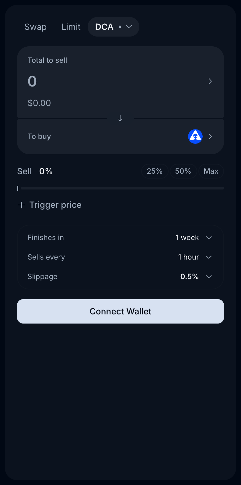
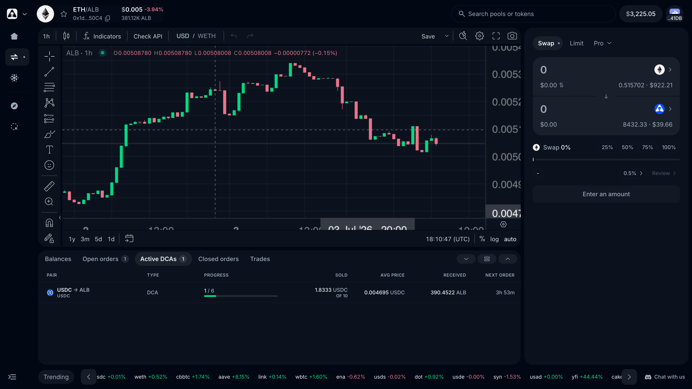

# DCA Orders

A DCA (Dollar-Cost-Average) order splits a single buy or sell into many smaller trades executed at regular intervals. It's the simplest way to enter or exit a large position without timing the market and without taking the price impact in one shot — and with the Epsilon Router upgrade it gained **trigger prices** and **stop-loss protection**.

> *Last updated: July 6, 2026.*

## Creating a DCA

1. Open [app.alienbase.xyz/swap](https://app.alienbase.xyz/swap), pick the pair.
2. Order form → **Pro** → **DCA**.
3. **Total to sell** — the full amount to be split (25% / 50% / Max shortcuts available).
4. **Finishes in** — the total duration (default **1 week**).
5. **Sells every** — the interval between chunks (default **1 hour**). Duration ÷ interval = number of trades.
6. (Optional) **+ Trigger price** — the DCA stays dormant until the market reaches this price, then starts executing.
7. Set slippage (default 0.5%) and confirm.

The order rests on-chain in the [Epsilon Router](epsilon.md#the-epsilon-router). At each interval the **Matcher** executes one chunk, routed through whichever venue gives the best price at that moment. Track progress in the **Active DCAs** tab of the positions panel: chunks completed, amount sold, average fill price, amount received, and countdown to the next order.

## Stop-loss DCA

A DCA can carry a **stop loss**: if price falls below your configured level mid-run, the remaining schedule aborts and the unspent balance is released. This protects long accumulation runs from catastrophic dips — you stop averaging into a token that's collapsing.

## When to use a DCA

- You're entering or exiting a large position and don't want to move the market in one trade.
- You're nervous about timing — DCA averages your entry across many ticks.
- You want "buy the breakout, slowly": set a trigger price above market and let the DCA start only if the level is claimed.

## When *not* to use a DCA

- You've decided this is the price you want — use a [Limit order](limit-orders.md) instead.
- You expect a binary event (catalyst, unlock) — DCA's averaging works against you here.
- You want to protect gains on an existing position — use a [Trailing Stop](trailing-stop.md).

## Fees

DCA fees are charged per executed chunk, tiered by asset class, plus a flat **0.05% Matcher execution fee** per fill (full table on [Fees](../fees.md)):

| Order type | Stables | Blue chips | Everything else |
| --- | --- | --- | --- |
| **DCA chunk** | 0.01% | 0.10% | 0.20% |
| **DCA stop-loss execution** | 0.10% | 0.20% | 0.45% |
| *+ Matcher fee* | *0.05%* | *0.05%* | *0.05%* |

Plus the underlying pool fee on whichever venue the chunk routes through, and gas at creation/cancellation (execution gas is handled by the Matcher).

## See also

- [Limit, Take Profit & Stop Loss](limit-orders.md) — precise-price entries and exits.
- [Trailing Stop](trailing-stop.md) — price-based selling instead of time-based.
- [Epsilon](epsilon.md) — the router + matcher underneath.
- [Fees](../fees.md)
