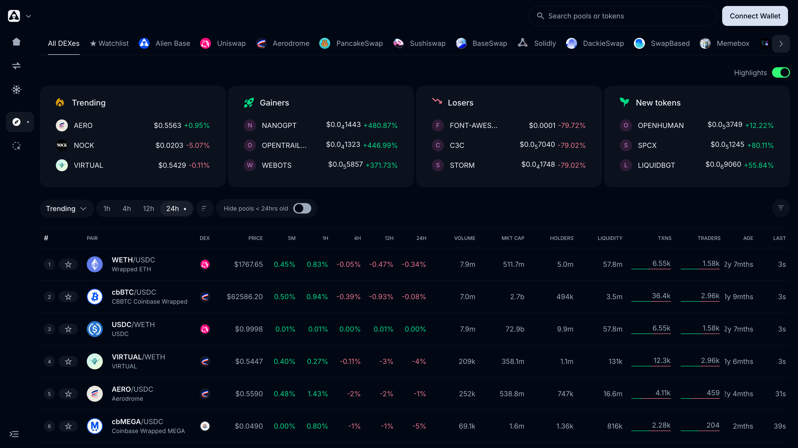
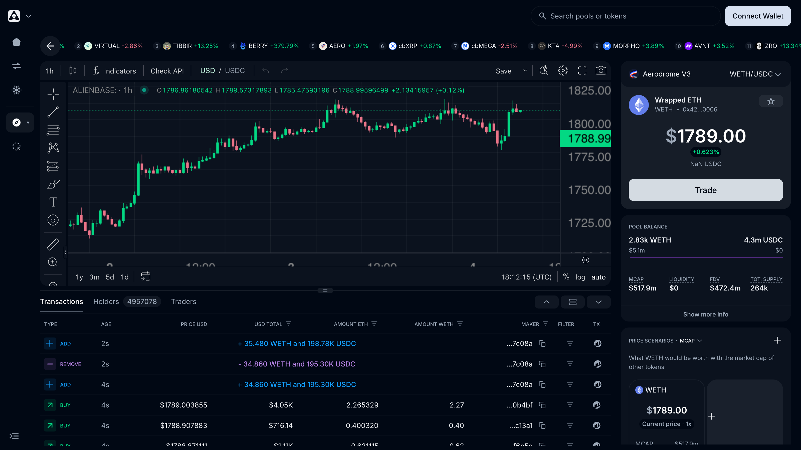

# Explorer (Epsilon Analytics)

The **Explorer** (in the dApp sidebar) is Alien Base's chain-wide data explorer, powered by Epsilon's data layer. Every token on Base, every pool on every DEX, every trade — searchable, with safety checks built in.

> *Last updated: July 6, 2026.* Launched May 2025 as "Epsilon Analytics".

## What it does

Three core surfaces:

- **Overview** — top pairs by volume, liquidity, and price action across the whole of Base. Filterable by DEX (Alien Base / Uniswap / Aerodrome / PancakeSwap / Sushiswap / BaseSwap / Solidly / DackieSwap / SwapBased / Memebox / Synthswap / BunnySwap / KyberSwap), with Trending / Gainers / Losers / New tokens highlights and a configurable time window (1h / 4h / 12h / 24h). Table columns include price change across five windows, volume, market cap, holders, liquidity, transaction count, trader count, pair age, and time since last trade.
- **Token detail** — for any token: live price, charts, holder distribution, top pools, top trades, and an automated **GoPlus safety check** flagging things like honeypot risk, owner-can-mint, blacklist functions, and so on.
- **Pool detail** — for any pool on any supported venue: TVL, 24h volume, fee tier, and recent trades.

Powerful filtering (Token Filters panel) lets you slice on price, liquidity, market cap, holder count, age, txn count, dev address, "show risky tokens" toggle, and more. Useful for systematic discovery; brutal for memecoin hunters.

Access via the **Explorer** entry in the dApp sidebar, or directly at [app.alienbase.xyz/info](https://app.alienbase.xyz/info).

## Why it exists

Most "DEX analytics" sites are surface-level — they list pairs, charts, maybe volumes. The Explorer is built on the same data layer that Epsilon uses for routing, which means:

- It sees **every** pool on Base, not just the most active ones.
- Token-safety signals are native; you don't need to open a separate site.
- Charts and pool stats are consistent with what the swap engine sees, so quoted prices and analytics prices match. The same data feeds the TradingView chart and token search inside the [trading terminal](swap.md).

## Roadmap

The next-phase Explorer work, called out on the [Roadmap](../roadmap.md):

- **On-chart order overlays + PnL tracking** on top of the TradingView integration already live in the terminal.
- **Wallet-cluster analysis** — multi-wallets per user, bot detection, whale activity, team-sell detection.

## See also

- [Epsilon](epsilon.md) — the routing engine that shares the Explorer's data layer.
- [Trading Terminal & Swap](swap.md) — where the same data surfaces per-pair.
- [GoPlus security API](https://gopluslabs.io/) — the third-party safety-signals provider.
