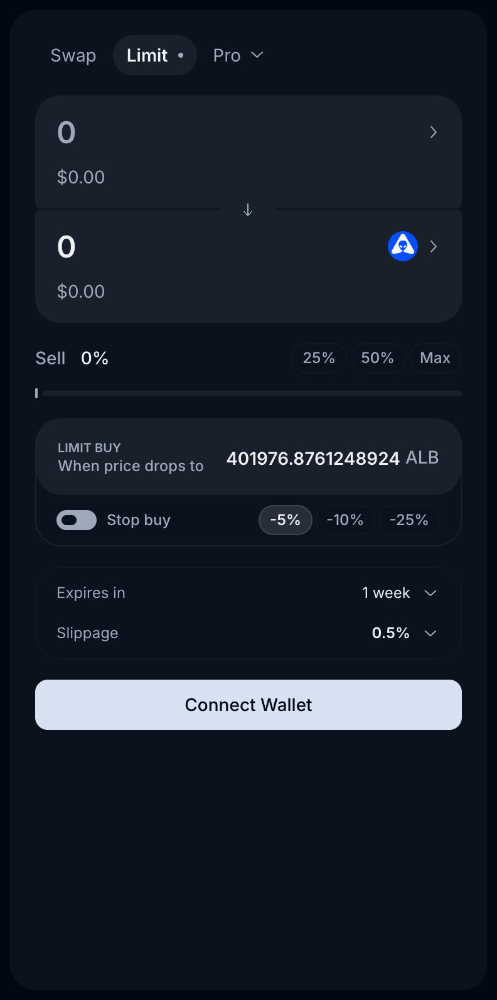
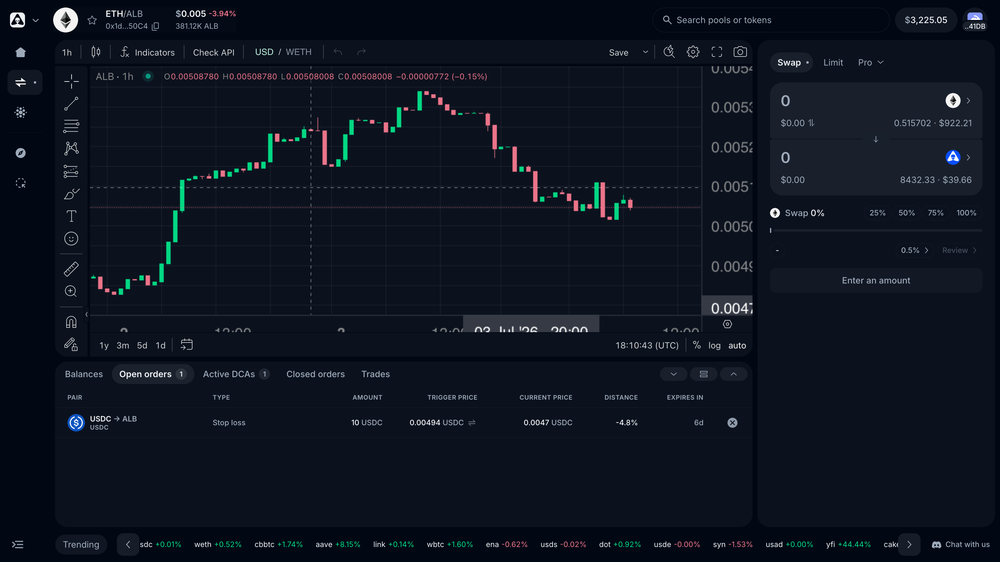
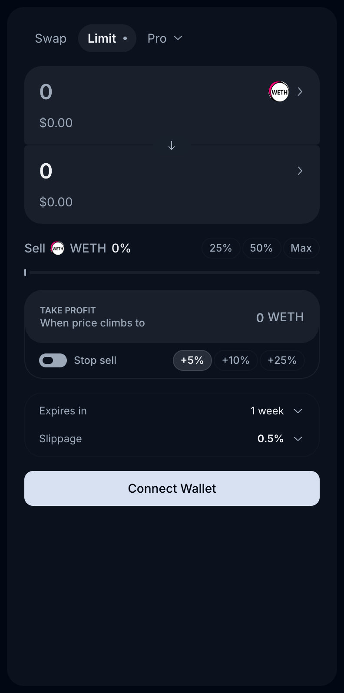
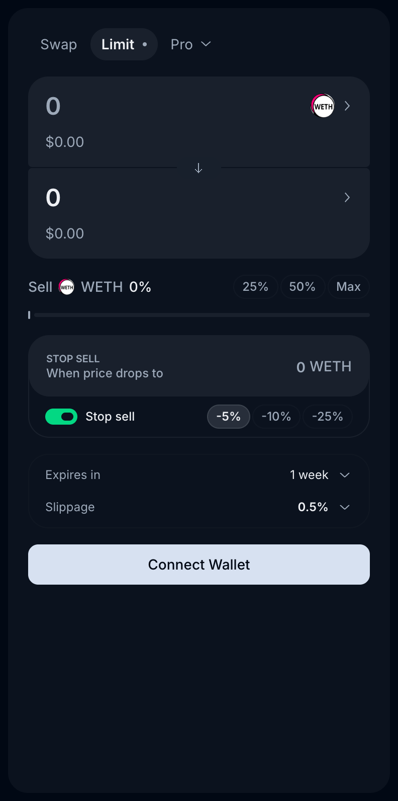

# Limit, Take Profit & Stop Loss

The **Limit** tab of the trading terminal covers every "trade at my price, not the market's price" scenario. Four order modes, all executed on-chain by the [Epsilon Router](epsilon.md#the-epsilon-router):

| Mode            | Direction | Triggers when…                 | Typical use                       |
| --------------- | --------- | ------------------------------ | --------------------------------- |
| **Limit Buy**   | Buy       | Price **drops to** your level  | "Buy the dip at my price"         |
| **Stop Buy**    | Buy       | Price **climbs to** your level | "Buy the breakout confirmation"   |
| **Take Profit** | Sell      | Price **climbs to** your level | "Sell into strength at my target" |
| **Stop Loss**   | Sell      | Price **drops to** your level  | "Cut the loss automatically"      |

> _Last updated: July 6, 2026._

## How the modes map to the UI

The form adapts to the direction of your trade:

* **Buying** (selling a quote asset like WETH/USDC for a token): the form shows **LIMIT BUY — "When price drops to …"**. Flip the **Stop buy** toggle to trigger on a rise instead.
* **Selling** (disposing of a token): the form shows **TAKE PROFIT — "When price climbs to …"**. Flip the **Stop sell** toggle to turn it into a **STOP SELL** (stop loss) that triggers on a drop.

Quick preset buttons (**±5% / ±10% / ±25%**) set the trigger relative to the current market price, or type an exact price.

## Creating an order

1. Open [app.alienbase.xyz/swap](https://app.alienbase.xyz/swap) and select the pair.
2. Switch the order form to **Limit**.
3. Enter the amount to sell (or use the 25% / 50% / Max buttons).
4. Set the trigger price — preset percentage or exact value.
5. If you want the stop variant, flip the **Stop buy** / **Stop sell** toggle.
6. Choose the expiry (default **1 week**) and slippage (default 0.5%).
7. Review → confirm in your wallet.

The order, if created via signature, will not be visible onchain. You'll find it under **Open orders** in the positions panel — with type, amount, trigger price, live distance to trigger, and time to expiry — and its trigger level is drawn directly on the chart. Filled and expired orders move to **Closed orders**.

## Take Profit and Stop Loss together

A common pattern is bracketing a position: a **Take Profit** at your target and a **Stop Loss** below your entry, each for the same balance. Whichever triggers first sells the position; cancel the other from **Open orders**.

## How execution works

Orders are not held by a centralized operator. They rest in the **Epsilon Router** contract on-chain ([`0x303c…2580`](https://basescan.org/address/0x303ca5c65AabCb1CE242DF93F478c41E0E4D2580)), and the **Matcher** — Epsilon's execution engine — fills them when the trigger condition is met, routing the fill through whichever venue gives the best price at that moment (same engine as a regular swap).

Because triggering depends on observed market price and the fill routes through live liquidity, your slippage setting applies at execution time — exactly like a swap placed at that moment.

## Fees

Fees are tiered by asset class of the traded pair, plus a flat **0.05% Protocol execution fee** on every fill (see [Fees](../fees.md) for the full schedule):

| Order type               | Stables | Blue chips | Everything else |
| ------------------------ | ------- | ---------- | --------------- |
| **Limit / Take Profit**  | 0.01%   | 0.05%      | 0.10%           |
| **Stop Loss / Stop Buy** | 0.10%   | 0.20%      | 0.45%           |
| _+ Protocol fee_         | _0.05%_ | _0.05%_    | _0.05%_         |

Plus gas: you pay gas during approval, but not during order creation and cancellation; execution gas is handled by the Matcher.

## Expiry

Every order has an expiry (default **1 week**). If the trigger isn't hit before expiry, the order closes and will not be executed anymore. **Epsilon does not lock your funds.** Expired orders appear under **Closed orders**.

## What happened to Carbon Limit & Range orders?

Earlier versions of Alien Base offered Limit and Range orders powered by Bancor's Carbon protocol. Those are **deprecated** with the Epsilon Router upgrade: existing Carbon orders remain visible (and withdrawable) from your Dashboard, but new ones can't be created in the current app. See [Archive — Carbon Orders](../archive/carbon-orders.md).

## See also

* [Trailing Stop](trailing-stop.md) — a stop level that follows the price up.
* [DCA Orders](dca-orders.md) — split an entry/exit over time instead of one price.
* [Epsilon](epsilon.md) — the router + matcher underneath.
* [Fees](../fees.md)
