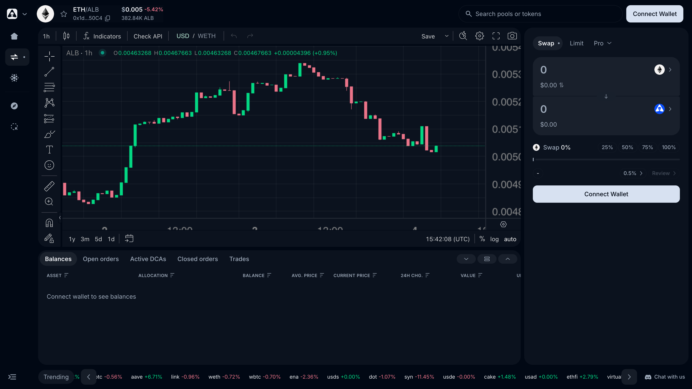
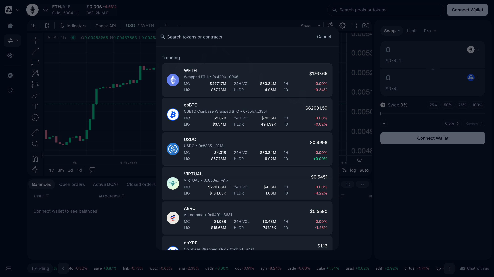

# Trading Terminal & Swap

Trading on Alien Base happens in a full **trading terminal**: a live TradingView chart, chain-wide token search, your balances and open orders, and every order type — Swap, Limit, Take Profit, Stop Loss, Trailing Stop, and DCA — in a single view.

> *Last updated: July 6, 2026.*

## The layout

Open [app.alienbase.xyz/swap](https://app.alienbase.xyz/swap):

- **Pair header (top).** The token you're trading, its contract address, live price, 24h change, and a watchlist star.
- **Chart (center).** A full TradingView chart with indicators, drawing tools, timeframes, and USD/WETH denomination toggle.
- **Order form (right).** Tabs for **Swap**, **Limit**, and **Pro** (Trailing Stop and DCA). This is where you build and submit orders.
- **Positions panel (bottom).** Five tabs that track your activity: **Balances** (per-asset allocation, average entry price, unrealized P&L), **Open orders**, **Active DCAs**, **Closed orders**, and **Trades**.
- **Trending ticker (bottom edge).** Live price change strip for the most active tokens on Base.

## Finding any token

Click **Search pools or tokens** in the top bar (or paste a contract address). Search covers every token and pool on Base — not just Alien Base's own list — with market cap, 24h volume, holders, and liquidity shown inline, so you can sanity-check a token before opening the chart.

## Making a swap

1. Connect your wallet.
2. In the **Swap** tab, choose the token you're selling (top) and the token you're buying (bottom).
3. Enter an amount — or use the 25% / 50% / 75% / 100% buttons or the slider.
4. The quoted output appears in the bottom field. [Epsilon](epsilon.md) computes it by routing across every venue on Base.
5. (Optional) Adjust slippage tolerance (default 0.5%).
6. Click **Review** → confirm in your wallet.

## Slippage

Slippage is the maximum acceptable difference between the quoted price and the executed price. If the price moves more than your tolerance during transaction submission, the swap reverts.

Sensible defaults:

- **0.1–0.5%** for stablecoin / blue-chip pairs.
- **0.5–1%** for typical token swaps.
- **2–5%+** for low-liquidity tokens or memecoins with on-trade fees.

If slippage is set too low for a volatile token, the swap will revert (and you'll burn gas). If set too high, your trade can be sandwich-attacked. Aim for the lowest value that lets the trade complete reliably.

## On-trade fees in tokens

Some Base tokens take an on-trade fee (a "tax" or "burn") inside their transfer logic. If you're trading one of these, set slippage high enough to cover the on-trade fee. The UI surfaces a warning when it detects a known fee-on-transfer token.

## What happens after Swap

- Transactions usually confirm in 1–3 seconds on Base.
- The trade appears immediately in the **Trades** tab of the positions panel; your **Balances** tab updates with the new allocation and average price.
- A success notification links to the Basescan transaction.

## Common issues

- **"Insufficient funds for gas."** Base needs a small amount of ETH for gas. Bridge or buy ~$1 worth.
- **"Price impact too high."** Liquidity is shallow for this pair. Try a smaller size, or split the entry with a [DCA order](dca-orders.md).
- **Pending transaction won't confirm.** See [Pending or failed transactions](../common-issues/pending-or-failed-transactions.md).

## See also

- [Epsilon](epsilon.md) — the routing + order-execution engine underneath every trade.
- [Limit, Take Profit & Stop Loss](limit-orders.md) — trade at your price, not the market's.
- [Trailing Stop](trailing-stop.md) — a stop that follows the price.
- [DCA Orders](dca-orders.md) — split a buy/sell over time.
- [Fees](../fees.md)
