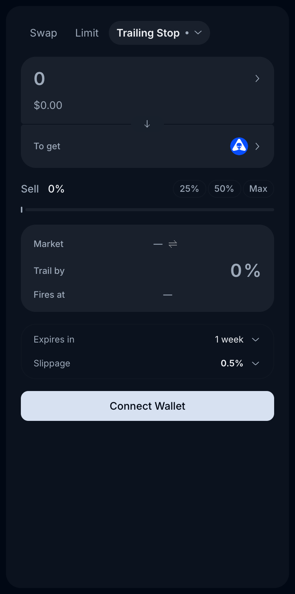

# Trailing Stop

A **Trailing Stop** is a sell order whose trigger level follows the market price upward. Instead of a fixed stop price, you set a **trail percentage**; the stop rides the price up as it climbs and fires only when the price retraces by your trail amount from its peak.

It's the "let winners run, but lock in gains" order — previously only available on centralized exchanges, now fully on-chain via the [Epsilon Router](epsilon.md#the-epsilon-router).

> *Last updated: July 6, 2026.*



## How it works

1. You place a sell order for a token and set **Trail by** — a percentage (e.g., 10%).
2. The order tracks the highest price observed since creation.
3. The **Fires at** level is always `peak price × (1 − trail%)`, shown live in the form.
4. If price keeps climbing, the fire level climbs with it — it never moves down.
5. When price retraces to the fire level, the **Matcher** executes the sell at the best available route.

```
   Price ▲
         │        peak ●
         │       ╱     ╲
         │  ●──╱        ╲ ← retrace hits trail % → SELL
         │ ╱    fire level rises with the peak
         │╱
         └──────────────────────▶ time
```

## Creating one

1. Open [app.alienbase.xyz/swap](https://app.alienbase.xyz/swap), pick the pair.
2. Order form → **Pro** → **Trailing Stop**.
3. Enter the amount to sell (25% / 50% / Max shortcuts available).
4. Set **Trail by** %. The form shows the current **Market** price and the resulting **Fires at** level.
5. Choose expiry (default **1 week**) and slippage (default 0.5%).
6. Confirm in your wallet. The order appears under **Open orders**.

## Choosing a trail percentage

- **Tight trails (2–5%)** lock in gains quickly but get stopped out by normal volatility — suited to stable pairs or short-horizon trades.
- **Medium trails (8–15%)** survive typical intraday noise on mid-caps.
- **Wide trails (20%+)** are for volatile small caps and memecoins, where 10% wicks are routine.

A useful rule: set the trail wider than the token's typical daily range, or ordinary chop will trigger the stop.

## Trailing stop vs. fixed stop loss

| | Fixed [Stop Loss](limit-orders.md) | Trailing Stop |
| --- | --- | --- |
| Trigger | Fixed price | Follows the peak |
| Protects | Your entry / a chosen floor | Accumulated unrealized gains |
| Best for | Defined invalidation level | Riding trends |

## Fees

Trailing Stops use the stop-order fee schedule, tiered by asset class, plus the flat 0.05% Matcher execution fee (full table on [Fees](../fees.md)):

| Stables | Blue chips | Everything else |
| --- | --- | --- |
| 0.10% + 0.05% | 0.20% + 0.05% | 0.45% + 0.05% |

Plus gas at creation and cancellation; execution gas is handled by the Matcher.

## See also

- [Limit, Take Profit & Stop Loss](limit-orders.md) — fixed-price triggers.
- [DCA Orders](dca-orders.md) — time-based selling instead of price-based.
- [Epsilon](epsilon.md) — the execution engine.
